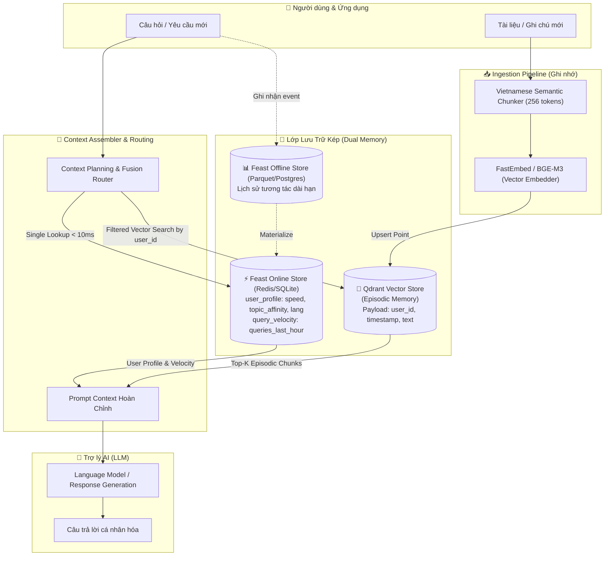

# Kiến Trúc Hệ Thống AI Hybrid Memory Cho Trợ Lý Cá Nhân

> **Tác giả:** Ngô Kỳ Anh  
> **Dự án:** Trợ lý AI Cá nhân hóa Tiếng Việt (Personal AI Assistant with Hybrid Memory)  
> **Phạm vi:** Bonus Challenge — Lab 19 (Vector Store + Feature Store)

---

## 1. Giới thiệu & Tầm nhìn bài toán

Hầu hết các hệ thống trợ lý LLM hiện nay đều gặp phải vấn đề **"mất trí nhớ có chọn lọc"**:
1. Nếu chỉ dùng **Vector Store (RAG)**: Hệ thống tìm lại được các đoạn hội thoại hoặc tài liệu trong quá khứ (*Episodic Memory*), nhưng hoàn toàn không biết người dùng là ai, có thói quen gì, đang hoạt động vào ban đêm hay ban ngày, hay có sở thích ngôn ngữ nào (*User Profile*).
2. Nếu chỉ dùng **Feature Store**: Hệ thống biết rất rõ các đặc trưng thống kê (*Tốc độ đọc, thể loại yêu thích, số lượng truy vấn 1 giờ qua*), nhưng không thể trích xuất được chi tiết ngữ cảnh cụ thể một bài báo hay câu chuyện mà người dùng đã từng đọc tuần trước.

Dự án này thiết kế và hiện thực hóa một kiến trúc **Dual-Memory (Bộ nhớ lai)** kết hợp hai trụ cột của Lab 19:
- **Vector Store (Qdrant)**: Đóng vai trò là **Episodic Memory** (Ký ức tình tiết dài hạn, tìm kiếm ngữ nghĩa).
- **Feature Store (Feast)**: Đóng vai trò là **Semantic & Behavioral Profile** (Đặc trưng người dùng ổn định và vận tốc hoạt động thời gian thực).

---

## 2. Sơ đồ kiến trúc tổng thể (Architecture Diagram)



---

## 3. Ba Quyết Định Kiến Trúc Then Chốt & Phân Tích Đánh Đổi (Tradeoffs)

### Quyết định 1: Chiến lược Chunking văn bản ghi nhớ (Chunking Strategy)
* **Lựa chọn X:** Semantic Chunking phân đoạn theo ranh giới câu và đoạn văn tự nhiên (kích thước tối đa 256 tokens, overlap 30 tokens).
* **Đối trọng Y:** Fixed-size Token Chunking cứng nhắc (ví dụ cứ 512 tokens cắt 1 lần) hoặc Message-level Chunking (mỗi tin nhắn là 1 chunk).
* **Lý do chọn X (Tradeoff Analysis):**
  * *Retrieval Quality vs Context Window:* Với trợ lý cá nhân, người dùng thường nhập ghi chú hoặc tài liệu kỹ thuật có độ dài không đều. Message-level chunking quá ngắn sẽ mất ngữ cảnh của các chủ đề phức tạp, trong khi 512 tokens cố định sẽ cắt ngang giữa các câu tiếng Việt có cấu trúc phức tạp.
  * Phân đoạn 256 tokens với overlap 30 tokens đảm bảo mỗi đoạn nhớ giữ trọn vẹn một ý niệm (single thought), đồng thời chi phí lưu trữ vector giảm thiểu và dễ dàng ghép 3–5 chunks vào context window mà không làm loãng prompt.

### Quyết định 2: Mô hình biểu diễn đặc trưng người dùng (Feature Schema Pattern)
* **Lựa chọn X:** Kết hợp **Tabular Behavioral Features** trong Feast + **Topic Affinity** dạng danh mục, thay vì lưu toàn bộ lịch sử thành 1 vector nhúng người dùng duy nhất (User Embedding).
* **Đối trọng Y:** Biến toàn bộ lịch sử đọc của người dùng thành 1 vector dense 1024 chiều duy nhất đại diện cho sở thích (Latent User Embedding Vector).
* **Lý do chọn X (Tradeoff Analysis):**
  * *Tính diễn giải (Explainability) & Khả năng kiểm soát (Steerability):* Một vector nhúng 1024 chiều là một "hộp đen". Ta không thể chèn trực tiếp vào prompt để chỉ dẫn LLM: *"Hãy trả lời bằng tiếng Việt ngắn gọn vì người này đọc với tốc độ 250 wpm"*.
  * Ngược lại, bảng đặc trưng của Feast (`reading_speed_wpm`, `preferred_language`, `topic_affinity`, `queries_last_hour`) cực kỳ minh bạch, độ trễ truy xuất online cực nhanh (< 2ms trên SQLite/Redis), và cho phép kỹ sư prompt điều hướng câu trả lời của LLM một cách chính xác tuyệt đối.

### Quyết định 3: Chiến lược độ tươi dữ liệu (Freshness & Materialization Strategy)
* **Lựa chọn X:** Kiến trúc tốc độ kép (**Dual-Speed Ingestion**):
  * *Episodic Memory (Vector Store):* **Near-Real-Time (< 500ms)** thông qua cơ chế Push API trực tiếp vào Qdrant ngay khi người dùng vừa nhập hoặc upload tài liệu.
  * *Profile Features (Feature Store):* **Periodic Batch Materialization (1 giờ/lần)** kết hợp bộ đếm sliding window trong bộ nhớ cục bộ cho `queries_last_hour`.
* **Đối trọng Y:** Streaming Feature Store toàn diện (Kafka + Flink + Feast Streaming Push) hoặc Batch toàn bộ mỗi ngày 1 lần.
* **Lý do chọn X (Tradeoff Analysis):**
  * *Chi phí hạ tầng vs Trải nghiệm người dùng:* Người dùng vừa lưu một ghi chú *"Tôi vừa chuyển nhà sang quận Cầu Giấy"* thì ngay câu hỏi tiếp theo họ muốn AI nhớ được ngay. Vì vậy, Episodic Memory bắt buộc phải có độ trễ sub-second.
  * Tuy nhiên, các đặc trưng như `reading_speed_wpm` hay `topic_affinity` thay đổi rất chậm theo thời gian (tính bằng ngày/tuần). Việc dựng cụm Kafka/Flink cho streaming feature profile là quá tốn kém và không cần thiết cho ứng dụng cá nhân. Cơ chế dual-speed cân bằng hoàn hảo giữa độ tươi và chi phí vận hành.

---

## 4. Quyết Định Kiến Trúc Cho Bối Cảnh Người Dùng Việt Nam (Vietnamese-Context Awareness)

### 4.1. Hiện tượng Code-Switching (Pha trộn Anh - Việt trong giới IT & Công nghệ)
Người dùng công nghệ tại Việt Nam thường xuyên đặt câu hỏi dạng:
> *"Cách config HPA autoscaling trên cụm K8s khi traffic tăng đột biến?"*

* **Giải pháp kiến trúc:**
  1. Sử dụng mô hình embedding đa ngữ có từ vựng subword phong phú (`BAAI/bge-m3` hoặc `multilingual-e5-large`), tránh các mô hình chỉ tối ưu cho tiếng Anh đơn thuần.
  2. Bổ sung cơ chế **Hybrid Search (BM25 + RRF)**: BM25 bắt chính xác các thuật ngữ gốc Anh (`HPA`, `K8s`, `config`), trong khi vector nắm bắt ngữ nghĩa phần tiếng Việt (*"khi traffic tăng đột biến"* $\approx$ *"lưu lượng người dùng quá tải"*).

### 4.2. Quyền riêng tư & Tuân thủ Nghị định 13/2023/NĐ-CP (Bảo vệ Dữ liệu Cá nhân)
* Khác với văn bản công cộng, bộ nhớ cá nhân chứa thông tin nhạy cảm (PII).
* **Thiết kế phân vùng (Multi-Tenant Isolation):** Mỗi bản ghi vector trong Qdrant bắt buộc phải gắn metadata `user_id` và được truy vấn bằng **Filtered Search**.
* **Right to be Forgotten (Quyền được xóa bỏ):** Kiến trúc hỗ trợ lệnh xóa triệt để:
  ```python
  client.delete(collection_name="user_memory", points_selector=Filter(must=[FieldCondition(key="user_id", match=MatchValue(value=user_id))]))
  ```
  giúp người dùng có thể xóa sạch toàn bộ ký ức của trợ lý về mình bất cứ lúc nào chỉ trong 1 thao tác.

---

## 5. Lựa Chọn Bị Loại Bỏ (Rejected Alternative)

* **Ý tưởng bị loại bỏ:** Lưu trữ toàn bộ các đoạn hội thoại quá khứ (Episodic Memory) dưới dạng cột đặc trưng `embedding` trong Feast Feature Store (Feast Embedding Feature View).
* **Lý do loại bỏ triệt để:**
  1. **Khác biệt về chu kỳ vòng đời (Lifecycle Mismatch):** Feature Store được thiết kế cho dữ liệu có cấu trúc với schema cố định, gắn theo thực thể (entity-centric) và có tần suất cập nhật theo mốc thời gian đều đặn. Ngược lại, ký ức hội thoại là dữ liệu phi cấu trúc, phát sinh ngẫu nhiên, cần đánh chỉ mục HNSW/Graph để tìm kiếm láng giềng gần nhất (ANN search).
  2. **Hiệu năng tìm kiếm tương đồng:** Mặc dù một số Feature Store hiện đại hỗ trợ vector similarity, nhưng khả năng hỗ trợ Hybrid RRF, bộ lọc metadata phức tạp và hiệu năng P99 < 15ms của Qdrant chuyên dụng vượt trội hơn hoàn toàn so với việc ép Feast làm công việc của một Vector Database.

---

## 6. Hạn Chế Hiện Tại & Hướng Phát Triển (Honest Limitations)

1. **Mã hóa dữ liệu khi nghỉ (Encryption-at-Rest):** Bản POC hiện tại lưu trữ vector và SQLite dạng plaintext trên ổ đĩa. Trong môi trường production, dữ liệu bộ nhớ người dùng cần được mã hóa AES-256 theo từng khóa riêng biệt của mỗi người dùng (Envelope Encryption).
2. **Quản lý phân rã ký ức theo thời gian (Memory Decay & Consolidation):** Người dùng có thể có những thói quen cũ không còn đúng (ví dụ: năm ngoái thích Python, năm nay chuyển sang Rust). Bản POC chưa cài đặt thuật toán giảm trọng số ký ức theo thời gian (Ebbinghaus forgetting curve).
3. **Đồng bộ đa thiết bị (Multi-Device Sync):** Hiện tại đang chạy in-memory / local storage. Bản production cần kết nối với cụm Qdrant Cloud và Redis Cluster có hỗ trợ phân tán theo vùng địa lý.
